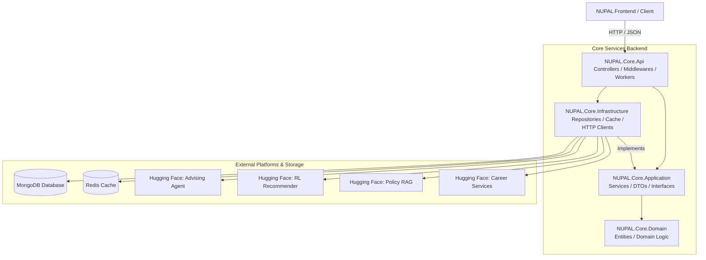

# NUPAL Core Services

[](https://github.com/nileuniversity/nupal-core-services/actions/workflows/main_nupal.yml)
[](https://dotnet.microsoft.com/download/dotnet/9.0)
[](https://www.mongodb.com/)
[](https://redis.io/)

NUPAL Core Services is the backend engine powering **Nile University Portal & Academic Link (NUPAL)**. Built on ASP.NET Core 9.0 using Clean Architecture principles, NUPAL orchestrates student administration, AI-driven academic advising, Reinforcement Learning (RL) course recommendations, resume parsing, job-fit analysis, and algorithmic class scheduling.

---

## 📖 Table of Contents
1. [Architecture Overview](#architecture-overview)
2. [Core Features](#core-features)
3. [Technology Stack](#technology-stack)
4. [Project Structure](#project-structure)
5. [Getting Started & Configuration](#getting-started--configuration)
6. [API Documentation](#api-documentation)
7. [Testing](#testing)
8. [CI/CD & Deployment](#cicd--deployment)

---

## 🏛️ Architecture Overview

The system is designed following **Clean Architecture** (Dependency Inversion Principle), separating business logic from infrastructure concerns. This maximizes testability, maintainability, and independence from databases or external services.



### Flow of Execution
1. The **Presentation Layer** (`NUPAL.Core.Api`) accepts HTTPS requests, validates JWT claims, and forwards data to the Application Layer via DTOs.
2. The **Application Layer** (`NUPAL.Core.Application`) contains orchestrating services and interfaces.
3. The **Domain Layer** (`NUPAL.Core.Domain`) models entities like `Student`, `ChatConversation`, `RlJob`, and `SchedulingBlock`.
4. The **Infrastructure Layer** (`NUPAL.Core.Infrastructure`) handles data persistence in MongoDB, caching via Redis, HTTP proxies to Python microservices hosted on Hugging Face, and hosted background queues.

---

## ✨ Core Features

### 1. 🤖 AI-Driven Advising & Policy RAG
* **Interactive Advisory Chatbot**: Connects students with an LLM-powered Advising Agent (`AgentServiceUrl`) that understands university curriculum and degree rules.
* **Academic Policy RAG**: Query-response interface referencing university manuals via a Retrieval-Augmented Generation (`RagServiceUrl`) endpoint.
* **Agent Trace Tracking**: Detailed step-by-step pipeline execution logging (`AgentPipelineTrace`) for performance monitoring and diagnostic debugging.

### 2. 🧠 Reinforcement Learning Recommendations
* **Dynamic Student Profiling**: Evaluates student GPA, track objectives, and course history to build feature vectors.
* **RL Recommendation Pipeline**: Queries the RL Recommender Space (`RlServiceUrl`) to generate personalized multi-term registration slates.
* **Precomputation Workers**: Asynchronous queues (`PrecomputeBackgroundWorker`, `RlPrecomputeQueueWorker`) keep recommendations updated in the background to ensure sub-second response times.

### 3. 💼 Career Services & Job Fit
* **Resume Parse Logging**: Stores parsed CV segments (`ResumeData`) detailing skills, experience, and education.
* **Wuzzuf Job Scraper Integration**: Pulls and caches active local market job opportunities.
* **Skill Semantic Normalization**: Matches courses to industry skills using vector semantics via Hugging Face model endpoints.
* **Job Fit Calculator**: Computes percentage compatibility scoring between student resumes and active jobs.

### 4. 📅 Algorithmic Scheduling & Registration
* **Timetable Construction**: Schedules course offerings into non-conflicting time slots (`SchedulingBlock`) using an optimization engine.
* **Registration Validation**: Enforces prerequisite constraints, block capacities, and semester limits.

### 5. 🛠️ Administrative & Diagnostic Console
* **Bulk Ingestion API**: Securely import lists of students, course curricula, and skills mapping structures.
* **Diagnostic Operations**: DB connectivity checks, Redis cache invalidation, and external HTTP health metrics.

---

## 💻 Technology Stack

* **Core Platform**: ASP.NET Core 9.0 (C# 13)
* **Primary Database**: MongoDB (using the official MongoDB C# driver)
* **Distributed Caching**: Redis (managed via `StackExchange.Redis` and `IDistributedCache`)
* **Security & Auth**: JWT Bearer Tokens with custom authorization policies
* **Testing Engine**: xUnit, Coverlet (Coverage reporting), and Microsoft.NET.Test.Sdk
* **Orchestration**: Docker & Azure Web App App Services

---

## 📂 Project Structure

```text
NUPAL-Core-Services/
│
├── NUPAL.Core.Api/                # ASP.NET Core Web API Project
│   ├── Controllers/               # REST Endpoints (Auth, Chat, Career, etc.)
│   ├── BackgroundServices/        # Keep-Alive & Task Workers
│   ├── Program.cs                 # App setup, dependency injection registration
│   └── appsettings.json           # Default app settings & timeouts
│
├── NUPAL.Core.Application/        # Application Core (Business Logic & Use Cases)
│   ├── DTOs/                      # Data Transfer Objects
│   ├── Interfaces/                # Repository & Service Interfaces
│   └── Services/                  # Core Business Services implementation
│
├── NUPAL.Core.Domain/             # Domain Entities (Independent of DB)
│   └── Entities/                  # Student, Chat, Scheduling, RlJob models
│
├── NUPAL.Core.Infrastructure/     # External Implementations
│   ├── Repositories/              # MongoDB Repository pattern implementations
│   ├── Services/                  # Redis Caching, HttpClients to HF, and Workers
│   └── DependencyInjection.cs     # Infrastructure bindings config
│
├── NUPAL.Core.Tests/              # Test Project
│   └── NUPAL.Core.Tests.csproj    # xUnit test suite configuration
│
├── Dockerfile                     # Multi-stage release container setup
└── Nupal.Core.Api.sln             # Solution entry point
```

---

## 🚀 Getting Started & Configuration

### Prerequisites
* **.NET 9.x SDK** or newer installed.
* **MongoDB Instance**: Either local MongoDB server or a MongoDB Atlas cluster URI.
* **Redis Instance**: Connection string for local or cloud-hosted Redis cache.

### Configuration Variables
Configure these variables in your `appsettings.Development.json` or as environment variables.

| Key | Description | Example / Default |
| --- | --- | --- |
| `MONGO_URL` | MongoDB cluster connection string | `mongodb+srv://...` |
| `Redis:ConnectionString` | Redis host, port, password options | `localhost:6379,abortConnect=False` |
| `Redis:InstanceName` | Prefix key namespaces for caching | `NUPAL:` |
| `RlServiceUrl` | Python RL course recommendation engine | `https://<recommender>.hf.space` |
| `AgentServiceUrl` | Advising agent chatbot backend | `https://<advising-agent>.hf.space` |
| `RagServiceUrl` | University policy vector retrieval server | `https://<policy-rag>.hf.space` |
| `CareerServices:Url` | Resume parser and job database service | `https://<career-services>.hf.space` |
| `CareerServices:ApiKey` | Access key for Career Services endpoint | `testkey123` |
| `Jwt:Key` | Symmetric signature key for signing JWTs | *(Minimum 256-bit secure key)* |
| `Jwt:Issuer` | Target issuer claim identifier | `NUPAL_Issuer` |
| `Jwt:Audience` | Audience identifier target | `NUPAL_Audience` |

### Setting Up Development Configuration
Configure secrets securely in your development environment using .NET User Secrets:

```bash
# Set Mongo URL
dotnet user-secrets set "MONGO_URL" "mongodb+srv://..." --project NUPAL.Core.Api/NUPAL.Core.Api.csproj

# Set Redis connection
dotnet user-secrets set "Redis:ConnectionString" "localhost:6379" --project NUPAL.Core.Api/NUPAL.Core.Api.csproj

# Set JWT Key
dotnet user-secrets set "Jwt:Key" "YourSuperSecretSymmetricKey123456!" --project NUPAL.Core.Api/NUPAL.Core.Api.csproj
```

### Running Locally
To build and run the services on your local machine:

```bash
# Restore packages & build the project
dotnet build Nupal.Core.Api.sln -c Debug

# Run the API project
dotnet run --project NUPAL.Core.Api/NUPAL.Core.Api.csproj
```
Once started, the server listens at **`http://localhost:5009`** (or configured development ports).

### Running in Docker
You can package the application into a container using the provided `Dockerfile`:

```bash
# Build the Docker image
docker build -t nupal-backend .

# Run the Docker container exposing port 8080
docker run -d -p 8080:8080 --name nupal-core-services \
  -e MONGO_URL="mongodb://host.docker.internal:27017/nupal" \
  nupal-backend
```

---

## 🔌 API Documentation

### Interactive Swagger UI
When running in `Development` mode, Swagger UI documentation is available at:
👉 **`http://localhost:5009/swagger/index.html`**

### Primary API Endpoints

| Category | HTTP Method | Route Path | Auth Required | Description |
| --- | --- | --- | --- | --- |
| **Authentication** | `POST` | `/api/students/login` | No | Student authentication via credentials, returns JWT. |
| **Student Profiles** | `GET` | `/api/students/profile` | Yes | Retrieves the profile, GPA, and course mappings of the authorized student. |
| **Advising Chat** | `POST` | `/api/chat/send` | Yes | Submits a query to the Advising AI. |
| | `GET` | `/api/chat/conversations` | Yes | Fetches all active conversation threads for the user. |
| | `DELETE` | `/api/chat/conversations/{id}`| Yes | Deletes a conversation thread. |
| **Agent Tracing** | `GET` | `/api/chat-trace/{convoId}` | Yes | Retrieves step execution traces of the LLM pipeline. |
| **Career & Resume**| `POST` | `/api/career-data/resume-analyses` | Yes | Ingests parsed resume data and stores analysis. |
| | `GET` | `/api/career-data/resume-analyses` | Yes | Retrieves all historical resume analyses. |
| | `POST` | `/api/career-data/job-fit-results` | Yes | Performs a compatibility analysis against job text. |
| **Scheduling** | `GET` | `/api/scheduling/blocks` | Yes | Lists available scheduling blocks and timetables. |
| | `POST` | `/api/scheduling/register` | Yes | Submits dynamic enrollment requests. |
| **System Admin** | `POST` | `/api/admin/import-students`| Yes (Admin Role)| Imports raw student files. |
| | `POST` | `/api/admin/system-settings`| Yes (Admin Role)| Overrides global timeouts, limits, or configurations. |
| **Diagnostics** | `GET` | `/api/diagnostic/check-rl` | Yes | Verifies recommendation caches and connection. |

---

## 🧪 Testing

The repository includes a xUnit test suite under **`NUPAL.Core.Tests`** to validate domain entities and application logic.

To run the unit tests:
```bash
dotnet test Nupal.Core.Api.sln --logger "console;verbosity=detailed"
```

To run test coverage (requires coverlet):
```bash
dotnet test Nupal.Core.Api.sln /p:CollectCoverage=true /p:CoverletOutputFormat=cobertura
```

---

## 🌐 CI/CD & Deployment

Deployments are automated using **GitHub Actions**. Push events to the `main` branch trigger the following steps in `main_nupal.yml`:
1. Checkout source code and bootstrap the `.NET 9.x` SDK environment.
2. Build code under `Release` configuration.
3. Run `dotnet publish` to output containerizable binaries.
4. Upload artifacts and push deployment package directly to the designated **Azure Web App slot** (`NUpal`).
